# leetCode-StudyGuide
This is my notebook for leetcode studying

## [Main Decision Tree](https://algo.monster/flowchart)

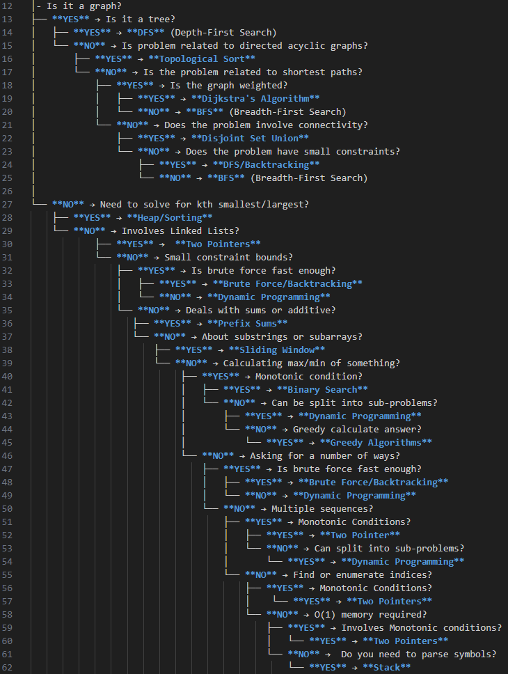

### For .md file editing

│- Is it a graph?
├── **YES** → Is it a tree?
│   ├── **YES** → **DFS** (Depth-First Search)
│   └── **NO** → Is problem related to directed acyclic graphs?
│       ├── **YES** → **Topological Sort**
│       └── **NO** → Is the problem related to shortest paths?
│           ├── **YES** → Is the graph weighted?
│           │   ├── **YES** → **Dijkstra's Algorithm**
│           │   └── **NO** → **BFS** (Breadth-First Search)
│           └── **NO** → Does the problem involve connectivity?
│               ├── **YES** → **Disjoint Set Union**
│               └── **NO** → Does the problem have small constraints?
│                   ├── **YES** → **DFS/Backtracking**
│                   └── **NO** → **BFS** (Breadth-First Search)
│
└── **NO** → Need to solve for kth smallest/largest?
    ├── **YES** → **Heap/Sorting**
    └── **NO** → Involves Linked Lists?
            ├── **YES** →  **Two Pointers**
            └── **NO** → Small constraint bounds?
                ├── **YES** → Is brute force fast enough?
                │   ├── **YES** → **Brute Force/Backtracking**
                │   └── **NO** → **Dynamic Programming**
                └── **NO** → Deals with sums or additive?
                   ├── **YES** → **Prefix Sums**
                   └── **NO** → About substrings or subarrays?
                       ├── **YES** → **Sliding Window**
                       └── **NO** → Calculating max/min of something?
                            ├── **YES** → Monotonic condition?
                            │   ├── **YES** → **Binary Search**
                            │   └── **NO** → Can be split into sub-problems?
                            │       ├── **YES** → **Dynamic Programming**
                            │       └── **NO** → Greedy calculate answer?
                            │           └── **YES** → **Greedy Algorithms**
                            └── **NO** → Asking for a number of ways?
                                ├── **YES** → Is brute force fast enough?
                                │   ├── **YES** → **Brute Force/Backtracking**
                                │   └── **NO** → **Dynamic Programming** 
                                └── **NO** → Multiple sequences? 
                                    ├── **YES** → Monotonic Conditions?
                                    │   ├── **YES** → **Two Pointer**
                                    │   └── **NO** → Can split into sub-problems? 
                                    │       └── **YES** → **Dynamic Programming**
                                    └── **NO** → Find or enumerate indices?
                                        ├── **YES** → Monotonic Conditions?
                                        │    └── **YES** → **Two Pointers** 
                                        └── **NO** → O(1) memory required?
                                            ├── **YES** → Involves Monotonic conditions?
                                            │   └── **YES** → **Two Pointers** 
                                            └── **NO** →  Do you need to parse symbols?
                                                └── **YES** → **Stack** 

## Algorithm Quick Reference & Optimal Implementations

### Graph Algorithms

#### DFS - Tree traversal, connected components, cycle detection
**Time Complexity:** O(V + E) | **Space Complexity:** O(V)  
**Best for:** Exploring all paths, detecting cycles, topological ordering, finding connected components in trees/graphs

```python
def dfs(graph, start, visited=None):
    if visited is None:
        visited = set()
    visited.add(start)
    result = [start]
    
    for neighbor in graph.get(start, []):
        if neighbor not in visited:
            result.extend(dfs(graph, neighbor, visited))
    
    return result
```
[View all DFS implementations →](python_algorithms/dfs.py)

#### BFS - Shortest path (unweighted), level-order traversal
**Time Complexity:** O(V + E) | **Space Complexity:** O(V)  
**Best for:** Finding shortest path in unweighted graphs, level-order traversal, finding minimum steps/hops

```python
from collections import deque

def bfs(graph, start):
    visited = set([start])
    queue = deque([start])
    result = []
    
    while queue:
        node = queue.popleft()
        result.append(node)
        
        for neighbor in graph.get(node, []):
            if neighbor not in visited:
                visited.add(neighbor)
                queue.append(neighbor)
    
    return result
```
[View all BFS implementations →](python_algorithms/bfs.py)

#### Dijkstra's - Shortest path (weighted, non-negative)
**Time Complexity:** O((V + E) log V) | **Space Complexity:** O(V)  
**Best for:** Finding shortest path in weighted graphs with non-negative weights, GPS navigation, network routing

```python
import heapq

def dijkstra(graph, start):
    distances = {node: float('inf') for node in graph}
    distances[start] = 0
    pq = [(0, start)]
    
    while pq:
        current_dist, current = heapq.heappop(pq)
        
        if current_dist > distances[current]:
            continue
            
        for neighbor, weight in graph[current]:
            distance = current_dist + weight
            
            if distance < distances[neighbor]:
                distances[neighbor] = distance
                heapq.heappush(pq, (distance, neighbor))
    
    return distances
```
[View all Dijkstra implementations →](python_algorithms/dijkstra.py)

#### Topological Sort - DAG ordering, dependency resolution
**Time Complexity:** O(V + E) | **Space Complexity:** O(V)  
**Best for:** Task scheduling, dependency resolution, course prerequisites, build systems

```python
from collections import deque, defaultdict

def topological_sort(graph):
    in_degree = defaultdict(int)
    
    # Calculate in-degrees
    for node in graph:
        for neighbor in graph[node]:
            in_degree[neighbor] += 1
    
    # Find nodes with no incoming edges
    queue = deque([node for node in graph if in_degree[node] == 0])
    result = []
    
    while queue:
        node = queue.popleft()
        result.append(node)
        
        for neighbor in graph[node]:
            in_degree[neighbor] -= 1
            if in_degree[neighbor] == 0:
                queue.append(neighbor)
    
    return result if len(result) == len(graph) else []  # Check for cycles
```
[View all Topological Sort implementations →](python_algorithms/topological_sort.py)

#### Disjoint Set Union - Connected components, union-find operations
**Time Complexity:** O(α(n)) ≈ O(1) per operation | **Space Complexity:** O(n)  
**Best for:** Dynamic connectivity queries, Kruskal's MST, detecting cycles, network connectivity

```python
class UnionFind:
    def __init__(self, n):
        self.parent = list(range(n))
        self.rank = [0] * n
    
    def find(self, x):
        if self.parent[x] != x:
            self.parent[x] = self.find(self.parent[x])  # Path compression
        return self.parent[x]
    
    def union(self, x, y):
        px, py = self.find(x), self.find(y)
        if px == py:
            return False
        
        # Union by rank
        if self.rank[px] < self.rank[py]:
            px, py = py, px
        
        self.parent[py] = px
        if self.rank[px] == self.rank[py]:
            self.rank[px] += 1
        
        return True
```
[View all Union-Find implementations →](python_algorithms/disjoint_set_union.py)

### Search & Optimization

#### Binary Search - Finding elements in sorted arrays, optimization problems
**Time Complexity:** O(log n) | **Space Complexity:** O(1)  
**Best for:** Searching sorted arrays, finding boundaries, optimization problems with monotonic properties

```python
def binary_search(arr, target):
    left, right = 0, len(arr) - 1
    
    while left <= right:
        mid = (left + right) // 2
        
        if arr[mid] == target:
            return mid
        elif arr[mid] < target:
            left = mid + 1
        else:
            right = mid - 1
    
    return -1  # Not found
```
[View all Binary Search implementations →](python_algorithms/binary_search.py)

#### Two Pointers - Array/string problems, finding pairs, palindromes
**Time Complexity:** O(n) | **Space Complexity:** O(1)  
**Best for:** Sorted array problems, palindrome detection, pair/triplet sum problems, removing duplicates

```python
def two_sum_sorted(arr, target):
    left, right = 0, len(arr) - 1
    
    while left < right:
        current_sum = arr[left] + arr[right]
        
        if current_sum == target:
            return [left, right]
        elif current_sum < target:
            left += 1
        else:
            right -= 1
    
    return [-1, -1]  # Not found
```
[View all Two Pointers implementations →](python_algorithms/two_pointers.py)

#### Sliding Window - Subarray/substring problems, fixed or variable window sizes
**Time Complexity:** O(n) | **Space Complexity:** O(1)  
**Best for:** Subarray/substring optimization, finding max/min in windows, character frequency problems

```python
def max_sum_subarray_k(arr, k):
    if len(arr) < k:
        return -1
    
    # Calculate sum of first window
    window_sum = sum(arr[:k])
    max_sum = window_sum
    
    # Slide the window
    for i in range(k, len(arr)):
        window_sum = window_sum - arr[i - k] + arr[i]
        max_sum = max(max_sum, window_sum)
    
    return max_sum
```
[View all Sliding Window implementations →](python_algorithms/sliding_window.py)

### Dynamic Programming
**Time Complexity:** O(n) | **Space Complexity:** O(n) memoization, O(1) optimized  
**Best for:** Optimization problems with overlapping subproblems, counting ways, decision problems

```python
def fibonacci(n, memo={}):
    if n in memo:
        return memo[n]
    
    if n <= 1:
        return n
    
    memo[n] = fibonacci(n - 1, memo) + fibonacci(n - 2, memo)
    return memo[n]

# Bottom-up approach (often more efficient)
def fibonacci_bottom_up(n):
    if n <= 1:
        return n
    
    dp = [0] * (n + 1)
    dp[1] = 1
    
    for i in range(2, n + 1):
        dp[i] = dp[i - 1] + dp[i - 2]
    
    return dp[n]
```
[View all Dynamic Programming implementations →](python_algorithms/dynamic_programming.py)

### Greedy Algorithms
**Time Complexity:** O(n log n) | **Space Complexity:** O(1)  
**Best for:** Activity selection, interval scheduling, making locally optimal choices for global optimum

```python
def activity_selection(activities):
    # Sort by end time
    activities.sort(key=lambda x: x[1])
    
    selected = [activities[0]]
    last_end_time = activities[0][1]
    
    for start, end in activities[1:]:
        if start >= last_end_time:
            selected.append((start, end))
            last_end_time = end
    
    return selected
```
[View all Greedy Algorithm implementations →](python_algorithms/greedy_algorithms.py)

### Data Structures

#### Heap - Priority queue, kth largest/smallest elements
**Time Complexity:** O(n log k) | **Space Complexity:** O(k)  
**Best for:** Priority queues, finding top K elements, median maintenance, task scheduling

```python
import heapq

def find_kth_largest(nums, k):
    # Use min-heap of size k
    heap = nums[:k]
    heapq.heapify(heap)
    
    for num in nums[k:]:
        if num > heap[0]:
            heapq.heapreplace(heap, num)
    
    return heap[0]
```
[View all Heap implementations →](python_algorithms/heap_sorting.py)

#### Stack - Parsing, matching brackets, monotonic stack problems
**Time Complexity:** O(n) | **Space Complexity:** O(n)  
**Best for:** Expression parsing, bracket matching, monotonic problems, function call simulation

```python
def is_valid_parentheses(s):
    stack = []
    mapping = {')': '(', '}': '{', ']': '['}
    
    for char in s:
        if char in mapping:
            if not stack or stack.pop() != mapping[char]:
                return False
        else:
            stack.append(char)
    
    return len(stack) == 0
```
[View all Stack implementations →](python_algorithms/stack.py)

#### Prefix Sums - Range sum queries, subarray sum problems
**Time Complexity:** O(1) query, O(n) preprocessing | **Space Complexity:** O(n)  
**Best for:** Range sum queries, subarray sum problems, cumulative frequency analysis

```python
class PrefixSum:
    def __init__(self, nums):
        self.prefix = [0]
        for num in nums:
            self.prefix.append(self.prefix[-1] + num)
    
    def range_sum(self, left, right):
        return self.prefix[right + 1] - self.prefix[left]
```
[View all Prefix Sum implementations →](python_algorithms/prefix_sums.py)

### Brute Force/Backtracking
**Time Complexity:** O(n!) for permutations, O(2^n) for subsets | **Space Complexity:** O(n) recursion depth  
**Best for:** Generating all combinations/permutations, N-Queens, Sudoku, constraint satisfaction problems

```python
def generate_permutations(nums):
    def backtrack(current_perm, remaining):
        if not remaining:
            result.append(current_perm[:])
            return
        
        for i in range(len(remaining)):
            current_perm.append(remaining[i])
            backtrack(current_perm, remaining[:i] + remaining[i+1:])
            current_perm.pop()
    
    result = []
    backtrack([], nums)
    return result
```
[View all Backtracking implementations →](python_algorithms/backtracking.py)


## Common Problem Patterns

### Graph Problems
- Connected Components — find components with DFS/BFS or Union-Find to label groups.
- Shortest Path — BFS for unweighted, Dijkstra for non-negative weights, Bellman-Ford if negatives.
- Cycle Detection — DFS with recursion stack (directed) or Union-Find/DFS (undirected).
- Bipartite Check — BFS/DFS two-coloring; fails if an odd cycle exists.
- Minimum Spanning Tree — Kruskal (sort edges + DSU) or Prim (priority queue).

### Array Problems
- Two Sum/Three Sum variants — hash map for two-sum; sort + two-pointers for k-sum.
- Sliding Window Maximum — maintain a monotonic deque to get O(1) max per window.
- Subarray Sum equals K — prefix-sum + hashmap for arbitrary ints; two-pointers if non-negative.
- Merge Intervals — sort by start time and merge overlapping intervals in one pass.
- Next Permutation — find pivot, swap with next larger, reverse suffix.

### String Problems
- Longest Palindromic Substring — expand around centers or use Manacher's for O(n).
- Edit Distance — DP on indices computing insert/delete/replace costs.
- Pattern Matching — KMP or Z-algorithm for linear-time substring search.
- Anagram Groups — normalize by sorted string or char-frequency key in hashmap.
- String Compression — run-length encoding or two-pointer in-place compression.

### Tree Problems
- Tree Traversals (Inorder, Preorder, Postorder) — recursive or iterative (stack) traversals.
- Lowest Common Ancestor — binary lifting for many queries; recursion for single-query trees.
- Binary Tree Maximum Path Sum — postorder DFS tracking max path through each node.
- Serialize/Deserialize — BFS/DFS encoding with null markers; parse back accordingly.
- Tree Diameter — two BFS/DFS passes: farthest node from arbitrary start, then farthest from it.

### Dynamic Programming Patterns
- 0/1 Knapsack — DP over items and capacity (choose/skip item).
- Unbounded Knapsack — DP allowing unlimited item reuse (complete knapsack).
- Longest Common Subsequence — 2D DP over prefixes of both sequences.
- Longest Increasing Subsequence — patience sorting with binary search for O(n log n).
- Matrix Chain Multiplication — interval DP to choose optimal parenthesization.
- Palindrome Partitioning — DP (min cuts) using palindrome checks (expand or DP preprocessing).


## ALGORITHM DETAILS
### Graph Algorithms
| Algorithm | Use Case | Time Complexity |
|-----------|----------|-----------------|
| **DFS** | Tree traversal, cycle detection | O(V + E) |
| **BFS** | Level-order, shortest path (unweighted) | O(V + E) |
| **Dijkstra's** | Shortest path (weighted, non-negative) | O((V + E) log V) |
| **Topological Sort** | DAG ordering, dependencies | O(V + E) |
| **Union-Find** | Connected components, MST | O(α(n)) ≈ O(1) |

### Optimization Algorithms
| Algorithm | Use Case | Time Complexity |
|-----------|----------|-----------------|
| **Binary Search** | Sorted arrays, monotonic conditions | O(log n) |
| **Two Pointers** | Pairs, palindromes, sorted arrays | O(n) |
| **Sliding Window** | Subarrays, substrings | O(n) |
| **Dynamic Programming** | Overlapping subproblems | O(n²) typical |
| **Greedy** | Activity selection, intervals | O(n log n) typical |

### Data Structures
| Structure | Use Case | Key Operations |
|-----------|----------|----------------|
| **Heap** | Priority queue, top K elements | O(log n) insert/delete |
| **Stack** | Parsing, matching brackets | O(1) push/pop |
| **Prefix Sums** | Range queries | O(1) query, O(n) build |


## CONSTRAINT-BASED SELECTION
### Time Complexity Requirements

| n (input size) | Acceptable Complexity | Suggested Approaches |
|---------------|----------------------|---------------------|
| n ≤ 10 | O(n!) | Brute force, Permutations |
| n ≤ 20 | O(2ⁿ) | Backtracking, Bit manipulation |
| n ≤ 100 | O(n³) | Triple loops, Floyd-Warshall |
| n ≤ 1000 | O(n²) | DP, Double loops |
| n ≤ 10⁵ | O(n log n) | Sorting, Binary Search, Heap |
| n ≤ 10⁶ | O(n) | Linear scan, Two Pointers |
| n ≤ 10⁸ | O(log n) or O(1) | Binary Search, Math |


# Graph Algorithms
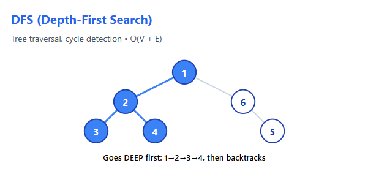

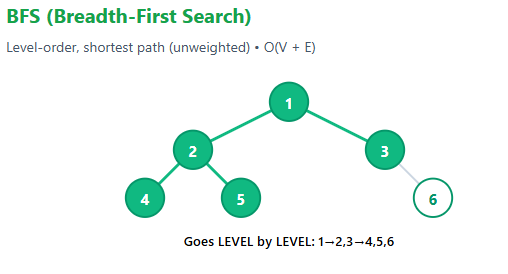

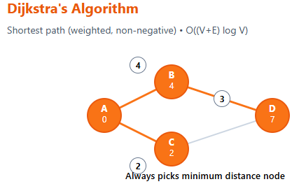

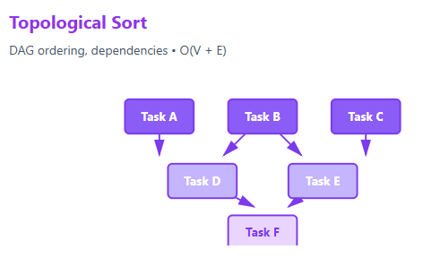

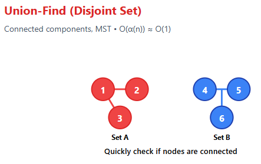

# Optimization Algorithms

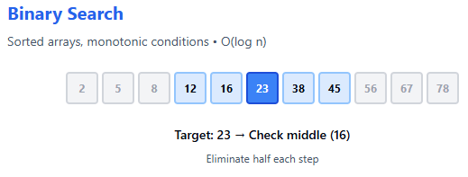

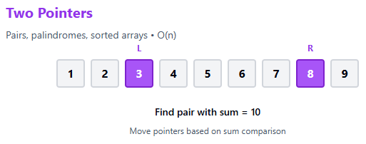

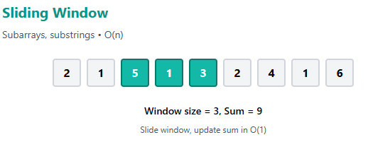

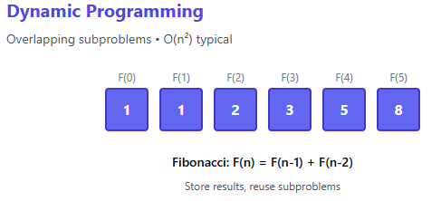

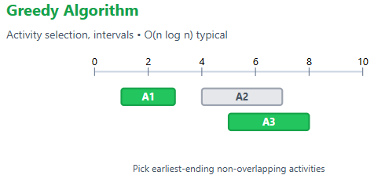

# Data Structures
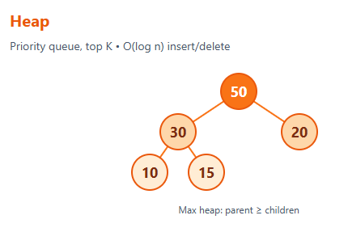

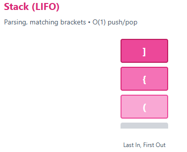

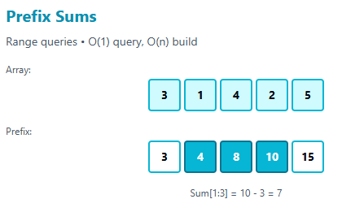

